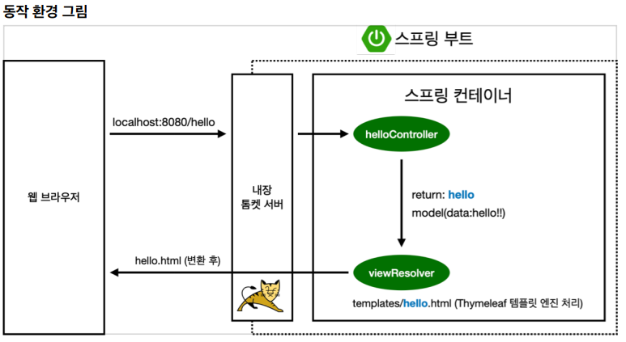

# [강좌] 스프링 입문 - 코드로 배우는 스프링 부트, 웹 MVC, DB 접근 기술 - chap 1. 프로젝트 환경 설정 - View 환경설정 (2)

# View 환경설정

* `resources/static/index.html` 을 만들어 놓으면 index 페이지로 설정해준다. 
    * index페이지 : 사이트에 접속하면 맨 처음 나오는 페이지.  
* 만들고 나서 서버를 껏다 다시 켜야한다.
  
* 스프링 부트가 제공하는 Welcome Page 기능
    * static/index.html 을 올려두면 Welcome page 기능을 제공한다.
    * https://docs.spring.io/spring-boot/docs/2.3.1.RELEASE/reference/html/spring-bootfeatures.html#boot-features-spring-mvc-welcome-page


## Welcome Page 만들기
```html
<!DOCTYPE HTML>
<html>
<head>
    <title>Hello</title>
    <meta http-equiv="Content-Type" content="text/html; charset=UTF-8" />
</head>
<body>
    Hello
    <a href="/hello">hello</a>
</body>
</html>
```

## thymeleaf 템플릿 엔진
* thymeleaf 공식 사이트: https://www.thymeleaf.org/

* 스프링 공식 튜토리얼: https://spring.io/guides/gs/serving-web-content/

* 스프링부트 메뉴얼: https://docs.spring.io/spring-boot/docs/2.3.1.RELEASE/reference/
html/spring-boot-features.html#boot-features-spring-mvc-template-engines


# 페이지 추가 

## Controller
웹 애플리케이션에서 첫번째 진입점.
컨트롤러를 만들때는 클래스에 `@Controller` 어노테이션을 추가해줘야한다. 

다른 페이지(뷰)들을 추가하려면 특정 url을 호출하는 Cotroller를 통하여 다른 페이지를 호출 해야 한다.


## ` com.ys.springboot.hellospring.controller`
```java
import org.springframework.stereotype.Controller;
import org.springframework.ui.Model;
import org.springframework.web.bind.annotation.GetMapping;

@Controller
public class HelloController {

    @GetMapping("hello")
    public String hello(Model model) {
        model.addAttribute("data", "hello");

        return "hello";
    }
}
```



1. 웹 브라우저에 `localhost:8080/hello` 라는 url을 입력하면, 스프링부트의 내장 톰캣이 url에 맞는 컨트롤러를 찾아 컨트롤러에 `hello`라는 `Get방식`으로 매핑이 되어있는 메서드를 찾아 호출한다. 
    * ### 컨트롤러는 요청에 따라 적절한 비즈니스 로직을 수행한 후 그 결과를 뷰에 전달한다. 

2. 컨트롤러는 전달할 속성들을 `model`이라는 객체에 담아 보낼 수 있다. 그 중 `addAttribute` 메서드는 `(key, value)` 방식으로 값을 담아 보낸다. 

3. hello 라는 메서드가 문자를 반환하는데, 문자를 반환하면 `뷰 리졸버`가 `resources/templates/` 에있는 hello라는 화면을 찾아서 렌더링 처리해준다.

* 컨트롤러에서 리턴 값으로 문자를 반환하면 `뷰 리졸버(viewResolver)`가 화면을 찾아서 처리한다.
   * 스프링 부트 템플릿엔진 기본 viewName 매핑
   * resources/templates/ +{ViewName}+ .html

## `resources/templates/hello.html`

```html
<!DOCTYPE HTML>
<html xmlns:th="http://www.thymeleaf.org">
<head>
    <title>Hello</title>
    <meta http-equiv="Content-Type" content="text/html; charset=UTF-8" />
</head>
<body>
<p th:text="'안녕하세요. ' + ${data}" >안녕하세요. 손님</p>
</body>
</html>
```
  
    
   
## 참고: `spring-boot-devtools` 라이브러리를 추가하면, html 파일을 컴파일만 해주면 서버 재시작 없이View 파일 변경이 가능하다.

##  인텔리J 컴파일 방법: 메뉴 build(망치) -> Recompile

---
# 빌드하고 실행하기

## 콘솔로 이동
1. ./gradlew build
2. cd build/libs
3. java -jar hello-spring-0.0.1-SNAPSHOT.jar
4. 실행 확인

## 빌드
`./gradlew build`를 실행하면 gradle이 빌드를 실행하고, 빌드가 완료되면 jar 파일이 담긴 build/libs 폴더가 생긴다. 빌드가 잘 안된다면 build/libs를 삭제하고 다시 빌드를 수행하도록$ ./gradlew clean build를 실행한다.

## 실행
build/libs로 이동해서 java -jar [Artifact명]-0.0.1-SNAPSHOT.jar를 실행하면 스프링 애플리케이션이 동작한다.   
서버에 배포할 때도 이[Artifact명]-0.0.1-SNAPSHOT.jar 파일만 복사해서 서버에 넣어주고, `java -jar ... .jar` 명령어로 실행만 시켜주면 된다. 