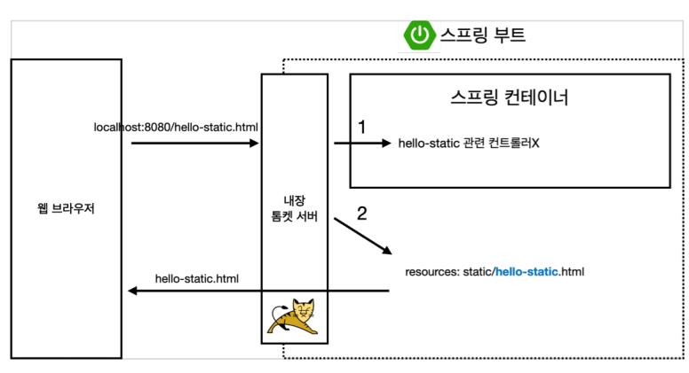
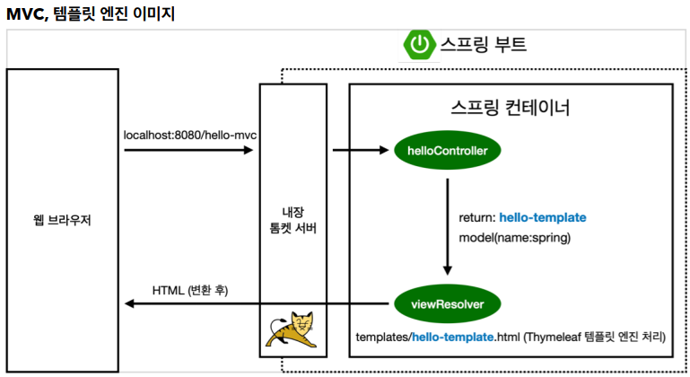
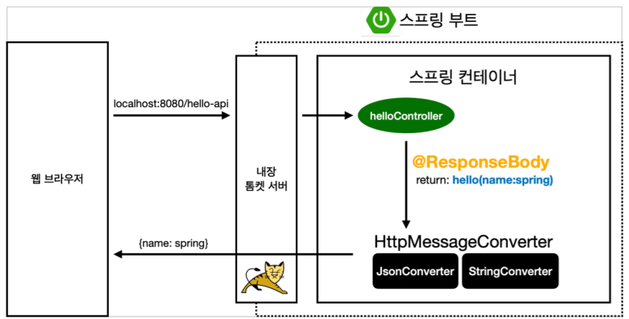

# 스프링 웹 개발 기초
* 정적 컨텐츠
* MVC와 템플릿 엔진
* API


# `정적 컨텐츠 `
서버에서 맵핑이나, 데이터를 가공하는 등 하는거 없이 `파일 그대로` 웹브라우저에 보여주는 것. 

* 스프링 부트 정적 컨텐츠 제공 기능
 
* https://docs.spring.io/spring-boot/docs/2.3.1.RELEASE/reference/html/spring-bootfeatures.html#boot-features-spring-mvc-static-content

* 컨트롤러 맵핑 없이 접속할 수 있다. 
  
* `resources/static/hello-static.html`
    ```html
    <!DOCTYPE HTML>
    <html>
    <head>
        <title>static content</title>
        <meta http-equiv="Content-Type" content="text/html; charset=UTF-8" />
    </head>
    <body>
    정적 컨텐츠 입니다.
    </body>
    </html>
    ```

    * http://localhost:8080/hello-static.html
   



스프링 컨테이너에서 요청을 받아, 컨트롤러측에서 먼저 찾는다.  
그러나 hello-static 관련 컨트롤러는 없으니, resources: static/hello-static.html을 찾아보고, 있으면 반환해준다.  

#  `MVC와 템플릿 엔진`
JSP, PHP 처럼 HTML을 동적으로 바꿔서 보여주는 것. 

MVC : Model, View, Controller

## Controller
```java
@Controller
public class HelloController {
    @GetMapping("hello-mvc")
    public String helloMvc(@RequestParam("name") String name, Model model) {
        model.addAttribute("name", name);
        return "hello-template";
    }
}
```

* 파라미터를 넘겨줄때 디폴트 설정을 할 수 있다.
    * ```@RequestParam(value = "name", required = false) String name```
        * required 가 true이면 무조건 파라마티거ㅏ 있어야 하고, false면 없어도 된다   

## resources/template/hello-template.html
```html
<html xmlns:th="http://www.thymeleaf.org">
<body>
<p th:text="'hello ' + ${name}">hello! empty</p>
</body>
</html>
```

프로그램을 개발할 때 관심사를 분리해야 하는데, `뷰`는 화면을 그리는데 모든 역량을 `집중`해야 한다. jsp처럼 뷰 역할과 컨트롤러를 같이 작성하여 비지니스 로직이 뷰와 꼬이면 유지보수가 정말 복잡해진다.  
그러므로 뷰와 컨트롤러와 모델을 분리해야 한다. 



### 실행
* http://localhost:8080/hello-mvc?name=spring
 
    * name 파라미터의 value를 spring으로 넘겨준것. 

    * 오류 : Resolved [org.springframework.web.bind.MissingServletRequestParameterException: Required String parameter 'name' is not present]
      * 파라미터가 안넘어와서 생긴 오류.


# `API` 방식

* JSON, XML 등 포맷으로 클라이언트에게 정보를 전달해줄 때 사용.
* 서버끼리 통신할 때 사용.

## @ResponseBody 문자 반환

```java
@Controller
public class HelloController {
    @GetMapping("hello-string")
    @ResponseBody
    public String helloString(@RequestParam("name") String name) {
        return "hello " + name;
    }
}
```

* `@RequestBody` 란?
    * html 프로토콜의 응답 body부의 데이터를 직접 넣어주겠단것

    * `@ResponseBody` 를 사용하면 `뷰 리졸버( viewResolver )`를 사용하지 않음
    *  HTTP의 BODY에 문자 내용을 직접 반환(HTML BODY TAG를 말하는 것이 아님)

## @ResponseBody 객체 반환

```java
@Controller
public class HelloController {
    
    @GetMapping("hello-api")
    @ResponseBody
    public Hello helloApi(@RequestParam("name") String name) {
    Hello hello = new Hello();
        hello.setName(name);
        return hello;
    }

    static class Hello {
        private String name;
        
        public String getName() {
            return name;
    }
    
    public void setName(String name) {
        this.name = name;
        }
    }
}
```
* `@ResponseBody 를 사용하고, 객체를 반환하면 객체가 JSON으로 변환됨` 

## `@ResponseBody 사용 원리`



ResponseBody를 사용했을 때, 객체가 오면 JSON 방식으로 반환해 주는것이 기본 정책이다.  

* @ResponseBody 를 사용시, 
    * HTTP의 BODY에 문자 내용을 직접 반환
    * viewResolver 대신에 HttpMessageConverter 가 동작
    * 기본 문자처리: StringHttpMessageConverter
    * 기본 객체처리: MappingJackson2HttpMessageConverter
    * byte 처리 등등 기타 여러 HttpMessageConverter가 기본으로 등록되어 있음

* 대표적인 JSON 변환 라이브러리
    * `JACKSON` <- 스프링 기본
    * `GSON`    <- 구글에서 만든 라이브러리 


> 참고: 클라이언트의 HTTP Accept 해더와 서버의 컨트롤러 반환 타입 정보 둘을 조합해서 `HttpMessageConverter` 가 선택된다. 더 자세한 내용은 스프링 MVC 강의에서 설명하겠다


