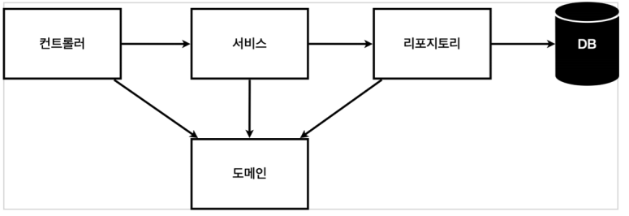
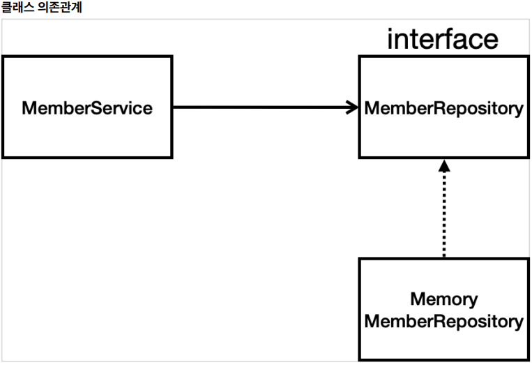

# [강좌] 스프링 입문 - 코드로 배우는 스프링 부트, 웹 MVC, DB 접근 기술 - chap 3. 회원 관리 예제 - 백엔드 개발 (1)

# 회원 관레 예제- 백엔드 개발

## 목차 

* 비즈니스 요구사항 정리
* 회원 도메인과 리포지토리 만들기
* 회원 리포지토리 테스트 케이스 작성
* 회원 서비스 개발
* 회원 서비스 테스트 - junit 테스트 프레임워크

# 비즈니스 요구사항 정리
강의의 목적이 복잡한 비즈니스가 아니라 간단한걸로 스프링 생태계와 동작방식을 배울 것이기 때문에 간단하게 한다.

* 데이터: 회원ID, 이름
* 기능: 회원 등록, 조회
* 아직 데이터 저장소가 선정되지 않음(가상의 시나리오)
    * RDBMS , NoSQL 등

## 일반적인 웹 애플리케이션 계층 구조

## `계층형 데이터 구조`
* `컨트롤러`: 웹 MVC의 컨트롤러 역할
* `서비스`: 핵심 비즈니스 로직 구현
* `리포지토리`: 데이터베이스에 접근, 도메인 객체를 DB에 저장하고 관리
* `도메인`: 비즈니스 도메인 객체, 예) 회원, 주문, 쿠폰 등등 주로 데이터베이스에 저장하고 관리됨

## `클래스 의존관계`

* 아직 데이터 저장소가 선정되지 않아서, 우선 인터페이스로 구현 클래스를 변경할 수 있도록 설계
* 데이터 저장소는 RDB, NoSQL 등등 다양한 저장소를 고민중인 상황으로 가정
* 개발을 진행하기 위해서 초기 개발 단계에서는 구현체로 가벼운 메모리 기반의 데이터 저장소 사용
    * 레포지토리를 인터페이스로 구현해놓으면 교체할때 편리하다.

## 회원 도메인과 레포지토리 만들기

## `회원 리포지토리 테스트 케이스 작성`
개발한 기능을 실행해서 테스트 할 때 자바의 main 메서드를 통해서 실행하거나, 웹 애플리케이션의 컨트
롤러를 통해서 해당 기능을 실행한다. 이러한 방법은 준비하고 실행하는데 오래 걸리고, 반복 실행하기 어렵
고 여러 테스트를 한번에 실행하기 어렵다는 단점이 있다. 
### 자바는 `JUnit`이라는 프레임워크로 테스트를 실행해서 이러한 문제를 해결한다.

### 회원 레포지토리 메모리 구현체 테스트
`src/test/java 하위 폴더에 생성한다`

* No tests found for given includes 이라는 오류 발생시 참고 
    *  https://www.inflearn.com/questions/15495
    *  https://stackoverflow.com/questions/55405441/intelij-2019-1-update-breaks-junit-tests

* `@AfterEach` : 한번에 여러 테스트를 실행하면 메모리 DB에 직전 테스트의 결과가 남을 수 있다. 이렇게 되
면 다음 이전 테스트 때문에 다음 테스트가 실패할 가능성이 있다. @AfterEach 를 사용하면 각 테스트가 종
료될 때 마다 이 기능을 실행한다. 여기서는 메모리 DB에 저장된 데이터를 삭제한다.

* 테스트는 각각 독립적으로 실행되어야 한다. 테스트 순서에 의존관계가 있는 것은 좋은 테스트가 아니다.

* 모든 테스트는 순서 보장이 안된다.
  * 그래서 의도치 않는 오류가 나올 수 있는데, 한 테스트가 끝나면 클리어를 해줘야 한다. 

